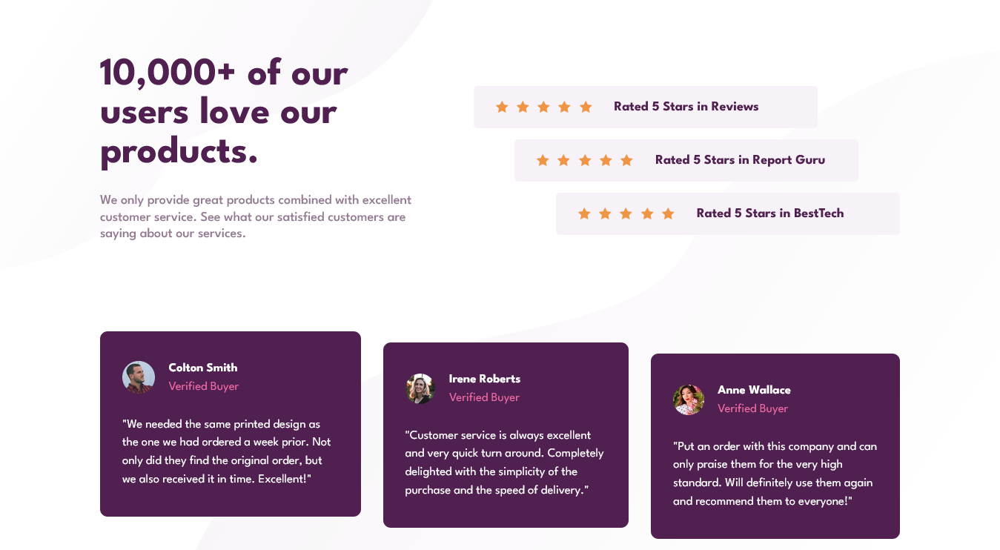

# Frontend Mentor - Social proof section solution

This is a solution to the [Social proof section challenge on Frontend Mentor](https://www.frontendmentor.io/challenges/social-proof-section-6e0qTv_bA). Frontend Mentor challenges help you improve your coding skills by building realistic projects. 

## Table of contents

- [Overview](#overview)
  - [The challenge](#the-challenge)
  - [Screenshot](#screenshot)
  - [Links](#links)
- [My process](#my-process)
  - [Built with](#built-with)
  - [What I learned](#what-i-learned)
- [Author](#author)
- [Acknowledgments](#acknowledgments)

## Overview

### The challenge

Users should be able to:

- View the optimal layout for the section depending on their device's screen size

### Screenshot

### Links

- Solution URL: [Solution](https://www.frontendmentor.io/solutions/social-proof-section-AZjLpm7vJH)
- Live Site URL: [Site](https://juanmartinrivas.github.io/social-proof-section-master/)

## My process

### Built with

- Semantic HTML5 markup
- CSS custom properties
- Flexbox
- Mobile-first workflow
- Sass
- Parcel

### What I learned

I learned how to properly set a background pattern with two different images. Other than that this was a really good project to practice my responsive development skills.

## Author

- Frontend Mentor - [@JuanMartinRivas](https://www.frontendmentor.io/profile/JuanMartinRivas)
- Twitter - [@RivasJuanman](https://twitter.com/RivasJuanman)
- Linkedin - [Juan Martín Rivas](https://www.linkedin.com/in/juan-mart%C3%ADn-rivas-b3253a1a8/)

## Acknowledgments

Thanks to anyone who helps me improve by giving me feedback on this project.
